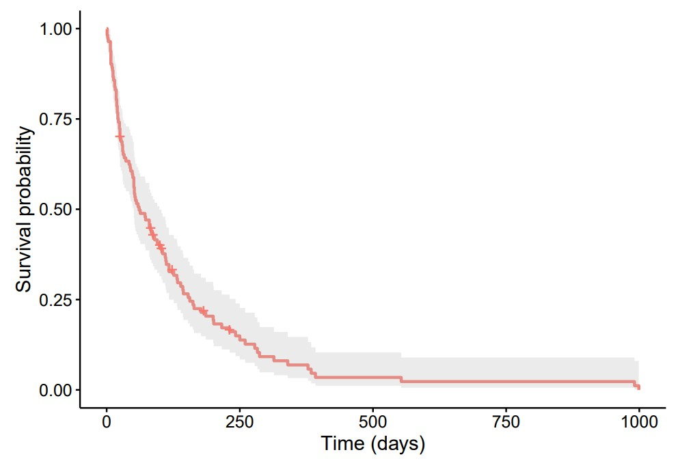
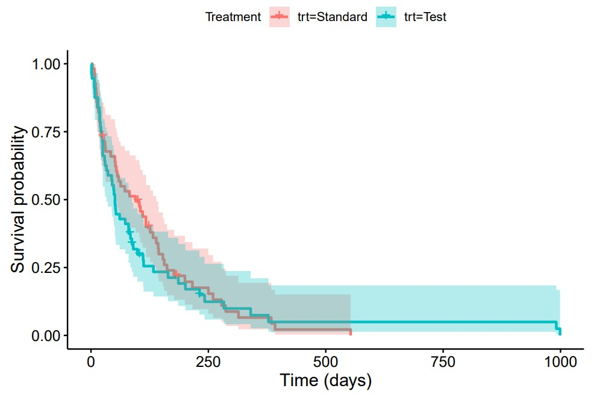
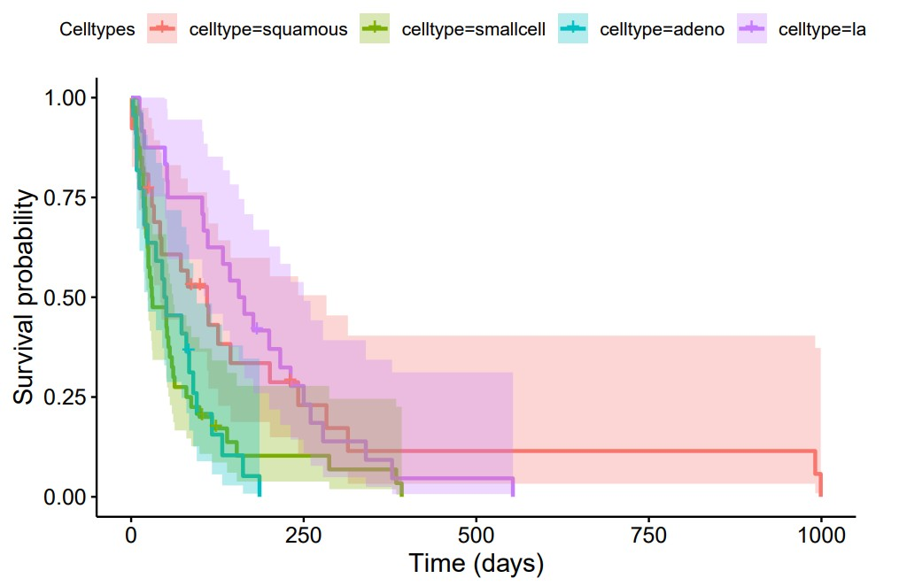

# Lung Cancer Survival Analysis and Prediction 

## Overview

This project applies survival analysis methods to examine survival patterns among lung cancer patients and uses an Accelerated Failure Time (AFT) model for survival time prediction. The analysis focuses on comparing survival across treatment groups and cancer cell type groups, identifying significant predictors of survival, and predicting survival time. The code was developed and executed using RStudio.

## Data

The project uses the Veteran dataset from the *survival* package in R, which contains 137 observations of 8 variables from a lung cancer experiment, including treatment and cancer cell type information, demographic and clinical characteristics, as well as survival time and censoring status.

The survival outcome includes 128 observed deaths and 9 right-censored observations. The 2 treatment groups (*trt*) are almost equal in size, providing a relatively balanced basis for comparison. Exploratory data analysis also suggests that the time from diagnosis to study enrollment (*diagtime*) and survival time (*time*) are positively skewed, with a few exceptionally high values.

Categorical variables (*trt, prior, status*) were converted into factors. The dataset was divided into training and test sets following an 80:20 ratio, preserving the class distribution of *status*. No missing values were present in the data.

## Methods

Variance Inflation Factor (VIF) values for all numeric predictors (*karno, diagtime, age*) were close to 1, indicating no evidence of multicollinearity. Since these 3 variables have relatively similar value ranges, standardization wasn't applied.

Kaplan-Meier survival curves were used to examine overall survival and compare survival outcomes across treatment and cancer cell type groups. Log-rank tests were then used to determine whether differences between groups were statistically significant.

A Cox Proportional Hazards (Cox PH) model was fitted to evaluate how treatment type (*trt*), cancer cell type (*celltype*), Karnofsky performance score (*karno*), time from diagnosis to study entry (*diagtime*), age, and prior therapy status (*prior*) relate to the hazard of death. The proportional hazards assumption was assessed using the Schoenfeld residual-based test.

Finally, an AFT model with a Weibull distribution was fitted to predict median survival time. Model performance was evaluated using Harrell's concordance index (C-index) on both the training and test sets.

## Results

***Figure 1:** Overall Kaplan-Meier curve.*

The overall Kaplan-Meier curve indicates poor overall survival among lung cancer patients, with a rapid decline in survival probability during the first 300 - 400 days after study entry. After approximately 600 days, the survival curve drops close to 0, indicating that only a very small proportion of patients survived
beyond this time. The 95% confidence interval becomes wider over time because fewer patients remain at
risk (*alive and still being followed*), making the survival estimates less reliable at later time points.

***Figure 2:** Kaplan-Meier curves for the Standard and Test treatment groups.*

When comparing the treatment groups, the Kaplan-Meier curves for both the *Standard* and *Test* groups showed very poor survival, with survival probability dropping rapidly during the first 300 - 400 days after study entry. The Standard treatment appears to have slightly higher survival probabilities early on, but then quickly approached 0 around day 550 while the Test treatment seems to have survival probabilities slightly above 0 until the end of the study. Only 2 Test group patients remained at risk by the end.

The confidence bands of the 2 curves above overlap considerably, especially after the first 100 - 200 days, suggesting that the estimated survival probabilities for the 2 treatment groups are not clearly distinguishable. In other words, the difference between the curves may simply be due to sampling variability rather than a treatment effect. Furthermore, the log-rank test found no statistically significant difference in survival between the Standard and Test treatment groups (p = 0.5).

***Figure 3:** Kaplan-Meier curves for the Squamous, Large cell, Small cell,* and *Adeno cell type groups.*

In contrast, when comparing the cancer cell type groups, the Kaplan-Meier curves showed noticeable differences in survival among the 4 cell types: *squamous, large cell, small cell,* and *adeno.* The squamous group generally exhibited the highest survival probabilities throughout most of the study period, whereas the small cell and adeno groups show the steepest declines in survival probability, indicating poor survival outcomes. The large cell group demonstrates intermediate survival, with a more gradual decline than the other groups during the first 250 days.

The curve corresponding to the adeno cell type approached 0 rapidly after around the first 200 days. The
small cell and large cell curves extended to approximately 400 and 550 days, respectively, while the squamous cell curve stayed around 0.15 until the end of the study. Only 2 squamous group patients remained at risk by the end. Additionally, the log-rank test found a statistically significant difference in survival among the 4 cell type groups (p = 0.001).

The Cox PH model was statistically significant overall (likelihood ratio test: p \< 0.001), indicating that at least one predictor was associated with patient survival. According to the model's results, Karnofsky performance score (*karno*) was significantly related to survival. The log-rank test earlier also showed that *celltype* was significantly associated with survival. By comparison, treatment type (*trt*), time from diagnosis to study entry (*diagtime*), age, and prior therapy status (*prior)* weren't significantly associated with survival after adjustment for the other variables.

According to the Cox PH model results, among the cell types,

- Patients with small cell type had a significantly different hazard of death than patients with squamous cell type after holding other predictors constant (p = 0.038). Specifically, patients with small cell type had 1.87 times the hazard of death compared to patients with squamous cell type (HR = 1.87).

- Patients with adeno cell type had a significantly different hazard of death than patients with squamous cell type after holding other predictors constant (p = 0.004). Specifically, patients with adeno cell type had 2.60 times the hazard of death compared to patients with squamous cell type (HR = 2.60).

- Patients with large cell type showed no significant difference in the hazard of death compared to patients with squamous cell type after holding other predictors constant (p = 0.552; HR = 1.206).

However, the proportional hazards assumption was violated globally (p = 0.0011), with statistically significant violations for *celltype* (p = 0.0057) and *karno* (p = 0.0039). Therefore, the Cox PH model results should be interpreted with caution, as the estimated hazard ratios may vary over time.

The Weibull AFT model achieved a C-index of 0.726 on the training set and 0.773 on the test set, suggesting no evidence of overfitting. The test set result indicates good predictive performance, with the model correctly ranking survival times for approximately 77.3% of comparable patient pairs. The slightly higher C-index on the test set may be due to random variation arising from the train-test split and the relatively small sample size.
